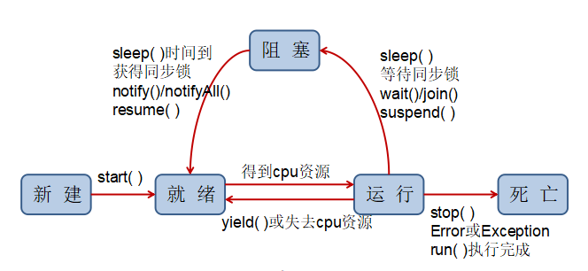

# java基础笔记

## 一、java的基本元素
1. 空白分隔符
    + 空格
    + Tab键
    + 换行符
2. 关键字
(不能用于变量名、类名、方法名等)
    + 访问控制：  
    `private` `protected` `public`
    + 类、方法、变量修饰符：  
    `abstract` `class` `extends` `final` `implements` `interface` `native` `new` `static` `strictfp` `synchronized` `transient` `volatile` `enum` `void` `var`
    + 程序控制：  
    `break` `continue` `return` `do` `while` `if` `else` `for` `instanceof` `switch` `case` `default`
    + 异常处理：  
    `try` `catch` `throw` `throws` `finally` `assert`
    + 包相关：  
    `import` `package`
    + 基本类型：  
    `byte` `short` `char` `int` `long` `float` `double` `boolean` (单独的标识类型：`null` `ture` `false`)
    + 变量引用：  
    `super` `this`
    + 保留字：  
    `goto` `const`
3. 标识符
    + 标识符是类、方法、变量的名字
    + 命名规则：
        + 可以包含数字、字母、下划线`_`、美元符号`$`，但是不能以数字作为开头
        + 区分大小写
        + 关键字是不能用作标识符的
        + 可以使用中文，但不建议使用
4. 注释
    + 单行注释：`//`
    + 多行注释：`/* */`
    + 文档注释：`/** */` (把关于程序的信息嵌入到程序内部，用javadoc工具来提取这些信息，形成帮助文档)
5. 分隔符
    + 除了注释和变量名可以出现中文之外(不建议中文变量名)，其它的地方一律是英文，各种标点符号也必须是英文状态下的
    + `()` **圆括号**   
        + 定义方法的参数表
        + 条件语句、循环语句中的条件定义
        + 定义表达式的优先级
    + `{}` **花括号**   
        + 初始化数组
        + 定义程序块、类、方法
    + `[]` **方括号**   
        + 声明数组类型
    + `;` **分号**  
        + 表示一个语句的结束
    + `,` **逗号**  
        + 变量声明时用于分隔多个变量
    + `.` **点号**  
        + 用于软件包和子包分隔
        + 用于类、对象和变量、方法分隔
    
## 二、八大基本数据类型及数据类型转换
1. 基本数据类型
    + 整型
        + `byte`    1字节 -128~127
        + `short`   2字节 -32768~32767
        + `int`     4字节 正负21亿多(用的最多)
        + `long`    8字节 特别大，当int不够用的时候，才会用long
    + 字符型
        + `char`    2字节 采用Unicode编码格式，支持中文
    + 浮点型
        + `float`   4字节 单精度
        + `double`  8字节 双精度(用的最多)
    + 布尔型
        + `boolean` 1字节 `true`真 `false`假
2. 自动转换
    + `byte` `short` `char` **>** `int` **>** `long` **>** `float` **>** `double` 
    + 目的类型比原来的类型要大
    + 两种类型是相互兼容的
    + `byte` `short` `char` 计算时会自动转换为`int`类型
    + 对于`byte` `short` `char`类型赋值，只要常量不超过它们的范围可直接赋值
3. 强制类型转换
    + (目标数据类型)目标
    + 浮点型转整型：把小数位截掉，保留整数位
    + 长整型赋给短整型：去位
    + 需要注意数据溢出

## 三、变量和常量
1. java的变量  
    + 值可以改变的量
    + 命名规则：
        + 遵循标识符命名规则
        + 尽量使用有意义的单词
        + 一般首字母小写
        + 英文的见名知意、驼峰命名法
2. java的常量  
    + 值不能改变的量
    + 各类型直接常量不能超过它们的范围，否则编译报错
    + 定义常量  
        + 使用final关键字
        + 习惯上常量都使用大写
    + 整型直接常量
        + 默认`int`类型
        + 前缀`0X` `0x`表示十六进制、`0`表示八进制、`0B` `0b`表示二进制
        + 后缀`L` `l`表示`long`类型
    + 浮点型直接常量
        + 默认`double`类型
        + 指数计数法`1.39E-43` `1.39e-43`表示`1.39×10^-43`
        + 后缀`D` `d`表示`double`类型，`F` `f`表示`float`类型
    + 字符型直接常量
        + 直接形式：`'A'`(对于特殊字符需要转义，换行符`'\n'`)
        + 八进制形式：`'\101'`
        + 十进制形式：`65`(`'A'`对应`65`，`'a'`对应`97`,`'0'`对应`48`)
        + 十六进制形式：`'\u0041'`
    + 布尔型直接常量
        + `true`真 `false`假
        
## 四、赋值与初始化
1. 赋值
    + 是给变量指定一个值或者是改变一个变量的值
    + `int a = 100;`初始化 `a = 200;`赋值
2. 初始化
    + 局部变量：
        + 在使用之前必须进行初始化(JDK1.4之前必须在声明时初始化)
    + 实例变量和静态变量(类变量)：
        + 编译器可以自动对它们进行初始化(`final`修饰的类变量必须初始化)
        + `byte` `short` `char` `int` `long` > `0`
        + `float` `double` > `0.0`
        + `boolean` > `false`
        + 引用数据类型 > `null`
    
## 五、字符串
1. 字符串类对象实例化
    + 直接赋值实例化 `String str = "Hello World.";`
    + 构造方法实例化 `String str = new String("Hello World.");`
    + 直接赋值实例化可重用相同的实例，构造方法实例化会开辟新的堆内存空间
2. 字符串比较
    + `equals`比较内容是否相等
    + `==`比较引用地址是否相等
3. 字符串连接
    + 可以用`+`来连接两个字符串(`+`在这里是一个连接运算符)
    + 字符串常量的内容不会改变，采用`+`连接符会生成新的字符串常量对象
    + 转义字符：每个转义字符都是由两个符号组成，但是编译器把他当成一个字符
        + `\n` 换行符 光标移动到下一行
        + `\r` 回车符 把光标移动到本行的开始处
        + `\t` 制表符
        + (`\r\n` windows `\n` linux `\r` mac 表示换行)
4. 字符串常量池
    + 直接赋值实例化的`String`对象保存在常量池中，供下次重用
    + 构造方法实例化的`String`对象也可调用`intern()`手动入池
    + 静态常量池
    ```java
    public class StringDemo {
        public static void main(String[] args) {
            //静态常量池
            //程序加载的时候会自动将程序中保存的字符串、普通的常量、类和方法等信息全部分配
            String strA = "www.iflytek.com";
            String strB = "www." + "iflytek" + ".com";
            //判断结果: true
            System.out.println(strA == strB);
        }
    }
    ```
    + 运行时常量池
    ```java
    public class StringDemo {
        public static void main(String[] args) {
            //运行时常量池
            //程序执行中动态的实例化字符串对象
            String logo = "iflytek";
            String strA = "www.iflytek.com";
            //频繁进行这样的操作会产生大量垃圾
            String strB = "www." + logo + ".com";
            //判断结果: false
            System.out.println(strA == strB);
        }
    }
    ```
5. 字符串其他常用操作：查阅API
   
## 六、运算符
1. 算数运算符
    + `+` `-` `*` `/` `%`
    + 取模运算不建议用于浮点型，结果可能不准确
    + 对于精度高的运算，需要使用BigDecimal类型
2. 算术赋值运算符
    + `+=` `-=` `*=` `/=` `%=`
    + 计算结果会进行数据类型的自动转换
3. 自增自减运算符
    + `++` `--`
    + `++i`先自增再运算 `i++`先运算再自增
    + `--i`先自减再运算 `i--`先运算再自减
4. 关系运算符
    + `>` `>=` `<` `<=` `==` `!=`
    + 返回值是`boolean`类型，一般用于判断语句中
5. 逻辑运算符
    + `&`逻辑与 `|`逻辑或 `!`逻辑非
    + `&&`短路与 `||`短路或
6. 位运算符
    + 实现对两个二进制数的位进行运算
    + `&`与 `|`或 `~`取反 `^`异或
    + `<<`左移位 `>>`有符号右移位 `>>>`无符号右移位
7. 三目运算符
    + `condition?statement1:statement2`
    + 该运算符的返回值类型为statement1和statement2中最大的类型
8. 运算符优先级
    + 算术运算符 > 关系运算符 > 逻辑运算符 > 三目运算符 > 赋值运算符
    + `()`括号内优先级最高

## 七、流程控制
1. 程序的三种结构
    + 顺序结构
    + 选择结构(分支结构)
    + 循环结构
2. 选择结构
    + `if`分支结构
        + `if`语句结构
        ```java
        if(condition){
            statement1;
        }
        ```
        + `if else`语句结构
        ```java
        if(condition){
            statement1;
        }else{
            statement2;
        }
        ```
        + 多条件判断
        ```java
        if(condition1){
            statement1;
        }else if(condition2){
            statement2
        }else{
            statement3;
        }
        ```
    + `switch`开关语句
        + `switch`语法
        ```java
        switch(variable){
            case value1:
                statement1;
                break;
            case value2:
                statement2;
                break;
            default:
                statement3;
                break;
        }
        ```
        + 所支持的`variable`类型`byte` `Byte` `short` `Short` `char` `Character` `int` `Integer` `String` `enum`
        + 重点要理解有`break`和没有`break`的区别
3. 循环结构
    + `while`循环结构
    ```java
    while(condition){
        loop body;
        updata condition;
    }
    ```
    + `do while`循环结构
    ```java
    do{
        loop body;
        updata condition;
    }while(condition);
    ```
    + `for`循环结构
    ```java
    for(initialize;condition;updata condition){
        loop body;
    }
    ```
    + `foreach`结构(加强`for`循环)
    ```java
    for(dataType variable:array|collection){
        loop body;
    }
    ```
    + 死循环`for(;;){}`比`while(true){}`效率高
    + 循环结构可以在内部嵌入若干个子循环结构
    + 循环控制语句
        + `break`语句 跳出当前循环
        + `continue`语句 停止本次循环，继续执行剩下的循环
        + `break` `continue`可与label配合跳出多层循环(每个代码块都可以用一个label)
        ```java
        outloop:
        for(int i=0;i<10;i++){
            for(int j=0;j<10;j++){
                if(j<i){
                    break outloop;
                }
            }
        }
        ```
        + `return`语句 从当前的方法中退出(非循环控制语句)
    
## 八、数组
1. 数组概述 
   
    + 数组就是一组数的集合，集合中的数据必须是相同类型的，并且每一个数组都有一个名字，也就是数组名，我们可以通过数组名来访问数组中的元素
2. 创建数组
    + `ArrayType arrayName[]=new ArrayType[length];`
    + `ArrayType[] arrayName=new ArrayType[length];//推荐写法`
3. 初始化方式
    + 方法一：
    ```java
    int[] array=new int[5];//同实例变量和静态变量(类变量)初始化
    array[0]=1;
    array[1]=2;
    array[2]=3;
    array[3]=4;
    array[4]=5;
    ```
    + 方法二：
    ```java
    int[] array={1,2,3,4,5};//这种写法只能用于声明时初始化
    ```
    + 方法三：
    ```java
    int[] array;
    array=new int[]{1,2,3,4,5};
    ```
4. 获取数组长度
    + 理解数组是一个对象
    + `arrayName.length`
5. 数组复制
    + `System.arraycopy(源数组,源数组起始位置,目标数组,目标数组起始位置,要复制的数组元素数量);`
    + `目标数组=Arrays.copyOf(源数组，目标数组长度);`
6. 数组排序
   
    + `Arrays.sort();`
7. 多维数组
    + java中只存在一维数组，多维数组只不过是数组中的数组
    + 不规则数组创建
        + 方法一：
        ```java
        int[][] array={{1},{1,2},{1,2,3}};
        ```
        + 方法二：
        ```java
        int[][] array=new int[3][];
        array[0]=new int[]{1};
        array[1]=new int[]{1,2};
        array[2]=new int[]{1,2,3};
        ```
8. 可变参数
    + 按照数组方式进行操作的
    ```java
    public static int sum(int... data){
        int sum=0;
        for(int temp:data){
            sum+=temp;
        }
        return sum;
    }
    ```
    + 可变参数一定要定义在最后
    + 一个方法只允许定义一个可变参数
9. 对象数组
    + 除了基本数据类型可以定义为数组，应用数据类型也可以定义数组
    + 操作上同基本数据类型相同

## 九、类的基础
1. 类的概述
    
    + 类就是事物的集合和抽象，它所代表的是这类事物所共有的一些行为和属性
2. 类的一般形式
    + 类是由属性(成员变量Field)和行为(方法Method)构成
    + 类的定义
    ```java
    [访问修饰符] class 类名称{
        成员变量;
        方法(包括构造方法);
    }
    ```
3. 对象的创建和使用
    + 对象是类的实例
    + 创建 `类名称 对象名称=new 类名称();`
    + 使用 `对象.成员变量` `对象.方法()`
    + 匿名对象的创建使用(没用引用) `new 类名称().方法()`
4. 对象类型的参数传递
    + java中只有值传递 (引用类型存储的值是地址，存储在**栈内存**)
    + 引用类型作为参数，操作的是引用指向的**堆内存**中的对象
    + GC(Garbage Collection)会不定期的对没有用的对象进行清理
5. 方法
    + 如果方法没有返回值，则必须写`void`不能省略
    + 如果有返回值，则定义的方法的类型必须和方法体内返回值的类型相同
    + `private static void main(String[] args){}`主方法(程序的入口)
    + 方法递归调用：
        + 递归调用指的是方法调用自己的特殊调用形式
        + 递归调用必须有结束条件
        + 每次调用的时候都需要根据需求改变传递的参数内容
6. 构造方法
    + 作用是用于初始化参数
    + 当没有写构造方法时，编译器会默认加上无参构造方法
    + 写了构造方法时，编译器不会默认加上无参构造方法
    + `this(参数列表);`调用本类其它构造器(只能调用一个构造方法且必须位于开始)
    + `super(参数列表);`调用父类构造器(只能调用一个构造方法且必须位于开始)
    + 构造方法的递归调用是不允许的
7. `this`和`super`对比
    |No.|对比|this|super|
    |:-:|:-:|:-:|:-:|
    |1|定义|表示本类对象|表示父类对象|
    |2|使用|本类操作：`this.属性` `this.方法` `this()`|父类操作：`super.属性` `super.方法` `super()`|
    |3|调用构造|调用本类构造，要放在首行|子类调用父类构造，要放在首行|
    |4|查找范围|先从本类查找，找不到查找父类|直接由子类查找父类|
    |5|特殊|表示当前对象|——|
8. 方法的重载
    + 发生在一个类中，方法名称相同，参数列表不同(参数类型不同、参数数量不同、参数次序不同)
    + 编译器在编译时会根据方法签名(方法名+参数列表)自动绑定调用的方法
    + 考虑到标准性重载方法一般都建议统一返回值类型
    + 构造方法也可以重载
9. `static`关键字
    + 静态变量
        + 静态变量是属于类的，和对象没有关系
        + 非静态变量是属于某个对象的，每个对象都有该数据的副本，而静态变量只有一个
        + 非静态变量保存在堆内存中，而静态变量保存在全局数据区
        + 访问静态变量可通过(类名.变量名)来访问的
    + 静态方法
        + 用`static`修饰的方法称为静态方法
        + 访问静态方法可通过(类名.方法名)
        + 静态方法不能访问非静态变量和方法，非静态方法可以访问静态变量和方法
        + 静态属性和方法是在类加载的时候产生的，非静态属性和方法是在new的时候产生的
10. `final`关键字
    + 使用`final`修饰过的都是不可改变的
    + `final`修饰变量：不可被重新赋值，变量名建议全部大写
    + `final`修饰方法：不可被重写，重载不会受到限制
    + `final`修饰类：不可被继承，该类不能作为任何类的父类
    + 静态常量 `public static final 类型 变量名=值;`
11. 代码块
    + 程序中使用`{}`定义起来的一段程序
    + 普通代码块：
        + 定义在方法中的代码块
        + 可以将一个方法中的代码进行部分分割
        + 每一个普通代码块中的局部变量不会对外面产生影响
    + 同步代码块：
        + 定义在方法中加`synchronized(同步对象)`的代码块
        + 代码块在同一个时间段内，只允许一个线程执行操作
        + 同步对象的选择会对其产生影响
    + 构造代码块：
        + 定义在类中的代码块
        + **每一次**实例化对象的时候执行
        + 构造代码块的执行优先于构造方法
    + 静态代码块：
        + 定义在类中加`static`的代码块
        + **第一次**实例化对象的时候执行
        + 静态代码块的执行优先于构造代码块
    
## 十、面向对象三大特征
1. 封装
    + 类：封装对象的属性和行为
    + 方法：封装了具体的业务逻辑功能行为
    + 访问控制修饰符：封装的具体的访问权限(属性私有化，方法公开化)
2. 继承
    + 实现代码的复用，减少代码的重复
    + `extends`只能继承一个类，java不支持多重继承，但可以`implements`实现多个接口
    + 子类继承父类之后，子类可以调用父类的属性和方法(传递性)，也可以重写父类的方法，覆盖父类的属性，还可以增加自己的属性和方法
    + 重写
        + 重写方法被调用时，看对象的类型，遵循运行期绑定
        + 遵循"两同两小一大"原则：
            + 发生在父子类中，方法名称相同，参数列表相同，方法体不同
            + 子类方法返回值类型应比父类方法返回值类型更小或相等(父类`double`子类`int`不行)
            + 子类方法声明抛出的异常类应比父类方法声明抛出的异常类更小或相等
            + 子类方法的访问权限应比父类方法的访问权限更大或相等
        + 父类`private`或`static`修饰的方法不能被重写
    + 注意子类定义和父类(或接口)相同名字的属性时的一些情况
    ```java
    class Father {
        int a = 1;
        void show() {
            System.out.println(a);
        }
        void show2() {
            System.out.println(a);
        }
    }
    class Son extends Father{
        int a = 10000;
        void show() {
            System.out.println(a);
            System.out.println(super.a);
        }
    }
    public class Demo {
        public static void main(String[] args) {
            Son son = new Son();
            son.show();
            son.show2();
            //输出结果为：10000 1 1
        }
    }
    ```
    + 创建子类对象的过程就是从底层的基类开始往上，一层层地调用构造方法
    + 在调用子类的构造器的时候，如果没有显示的写出`super`或`this`，那么编译器会在子类构造方法开头默认加上`super();`
3. 多态
    + 所谓多态，实际上就是一个对象的多种状态(允许程序中出现重名现象)  
    + 行为的多态、对象的多态
    + 向上造型(自动)
        + 父类的引用可以调用子类的对象
        + 能调用什么，看引用的类型
        + 并且调用的是子类重写后的方法，看对象类型，遵循运行期绑定
    + 向下转型(强制)
        + 必须先发生向上造型，之后才可以向下转型
        + `instanceof`判断为`true`可进行强制类型转换，否则会抛出`ClassCastException`异常
    + 多态的表现形式:
        + 重写：根据对象来多态
        + 重载：根据参数来多态

## 十一、注解Annotation
1. 注解概述
    + 可在类、方法、属性上进行标记
    + 又称元数据(MetaData)，其实就是代码里的特殊标记
    + 可以在不改变原有逻辑的情况下，在源文件中嵌入一些补充信息
    + 有成员变量称为元数据，无成员变量称为标记
2. 基本的Annotation
    + `@Override` 限定重写父类方法，该注释只能用于方法
    + `@Deprecated` 用于表示某个程序元素(类，方法)已过时
    + `@SuppressWarnings` 抑制编译器警告
3. 自定义注解
    + `@interface`关键字(其本身相当于一个接口，可以被实现)
    + 使用类似于接口方法声明的方式来定义注解的属性:其中返回值称为属性的类型，方法名为属性的名称
    + 设置默认属性值用`default`关键字 
    + `value`为注解系统内定属性名称，所以为其赋值时可以省略
    + 可以使用`@AliasFor("属性别名")`注解为注解的属性取别名(Spring中的注解)
4. JDK的元Annotation修饰其他Annotation定义
    + `@Retention` 指定Annotation可以保留多长时间 `RententionPolicy`
        + `SOURCE` 只会保留在程序源文件中，编译后不会保存
        + `CLASS` 编译后会保存在类文件中，但是不会随类加载到JVM中
        + `RUNTIME` 会随类一起加载到JVM中
    + `@Target` 指定被修饰的注解能用于修饰哪些程序元素 `ElementType`
    + `@Documented` 注解可被JavaDoc工具提取成文档
    + `@Inherited` 被它修饰的注解具有继承性，被子类自动继承
    ```java
    @Retention(RetentionPolicy.RUNTIME)
    @Target({ElementType.FIELD, ElementType.METHOD, ElementType.TYPE})
    @Inherited
    @Documented
    public @interface MyAnnotation {
        String value() default "Hello World!";
        String name() default "Du Huang";
    }
    ```
5. 通过反射机制提取Annotation信息
    ```java
    @MyAnnotation(value = "您好 世界!", name = "打爆任何人。")
    class Test {
        public static void main(String[] args) {
            Class<Test> clazz = Test.class;
            //Annotation[] annotations=MyAnnotation.class.getDeclaredAnnotations();
            //Annotation[] annotations=MyAnnotation.class.getAnnotations();
            if (clazz.isAnnotationPresent(MyAnnotation.class)) {
                //getDeclaredAnnotation...方法会忽略从父类继承的注解
                MyAnnotation myAnnotation = clazz.getAnnotation(MyAnnotation.class);
                System.out.println(myAnnotation.value());
                System.out.println(myAnnotation.name());
                System.out.println(myAnnotation.toString());
                System.out.println(myAnnotation.annotationType());
            }
        }
    }
    ```
    
## 十二、Object类和包装类 
1. `Object`类概述
    + 唯一没有父类的类
    + 所有类的父类，没有继承其它类的类默认继承`Object`
2. `Object`类部分方法
    + `toString()` 获取对象相关信息
    + `equals()` 对象比较
    + `clone()` 重写该方法的类需要实现`Cloneable`接口
    + `finalize()` 对象被回收时调用(`System.gc();` 可建议JVM回收垃圾，但是无法控制，因为这是由JVM的算法决定的)
3. 包装类概述
    + 为了满足面向对象概念，利用类结构对八大基本数据类型进行包装
    |No.|基本数据类型|包装类|父类|
    |:-:|:-:|:-:|:-:|
    |1|byte|Byte|Number|
    |2|short|Short|Number|
    |3|int|Integer|Number|
    |4|long|Long|Number|
    |5|float|Float|Number|
    |6|double|Double|Number|
    |7|boolean|Boolean|Object|
    |8|char|Character|Object|
4. 装箱与拆箱
    + 装箱：将基本数据类型保存到包装类中
        + 自动装箱`Integer iObject=i;`(包装类 变量=基本类型)
        + 手动装箱`Integer iObject=Integer.valueOf(i);`(包装类 变量=包装类.valueOf(基本类型))
    + 拆箱：从包装类中获取基本数据类型
        + 自动拆箱`int i=iObject`(基本类型 变量=包装类变量)
        + 手动拆箱`int i=iObject.intValue();`(基本类型 变量=包装类变量.intValue())
    + jdk1.5之后提供了自动装箱与自动装箱，jdk1.9开始包装类的构造方法上出现了过期声明
    + `Integer` `Byte` `Short` `Long` `Character` 也有与字符串常量池类似的对象池概念
        + 采用自动采用自动(或`valueOf()`方法)装箱的对象可复用(在一定范围内可复用)
        + 通过构造方法`new`对象不可复用
        + 具体表现在`==`和`equals()`比较的结果不同
5. 字符串与基本类型的相互转换
    + 基本类型转换为字符串
        + `基本类型+""` 会产生垃圾不推荐
        + `String.valueOf(基本类型)` 不会产生垃圾推荐
    + 字符串转换为基本类型
        + `Number`类的子类都提供相应的静态转换方法，例`int i=Integer.parseInt("1");`(如果转换失败抛出`NumberFormatException`)
        + `Character`类不需要此方法，`Boolean`提供`parseBoolean()`静态方法
        
## 十三、抽象类和接口
1. 抽象方法
    + 由`abstract`修饰的方法
    + 只有方法的定义，没有具体的实现(连`{}`都没有)
    + 抽象方法不允许使用`final`修饰
2. 抽象类
    + 由`abstract`修饰的类
    + 包含抽象方法的类必须是抽象类，不包含抽象方法的类也可以声明为抽象类(我乐意)
    + 抽象类不能被实例化
    + 抽象类是需要被继承的，子类：
        + 重写所有的抽象方法(变不完整为完整)
        + 也声明为抽象类(一般不这样做)   
    + 抽象类的意义:
        + 封装子类共有的属性和行为(代码复用)
        + 为所有子类提供统一的类型(向上造型)
        + 可以包含抽象方法，为所有子类提供统一的入口，子类的具体实现不同，但方法的定义是一致的
3. 接口
    + 是一种由`interface`定义的特殊的类
    + 接口中属性只能时常量(默认添加`public static final`)
    + 接口中方法只能是公共的，可以是`abstract`或`default`或`static`方法(`default`方法和`static`方法出现在jdk1.8以后，可以说是对有缺陷老代码的补救措施)
    + 接口中没有方法体的方法默认添加`public abstract`，其它默认添加`public`
    + 接口中内部类默认加`public static`(包括内部接口，内部抽象类)
    + 接口不能被实例化
    + 接口是需要被实现的，实现类必须重写接口中的所有抽象方法(或者声明为抽象类)
    + 一个类可以实现多个接口，用逗号分隔(若又继承又实现时，应先继承后实现)
    + 接口可以继承接口(可以继承好几个接口用逗号分隔)
    + 如果这几个接口有相同名字的变量，那么它们需要通过“接口名.变量名”的形式来访问
    + 如果这几个接口有相同名字的方法，如果是`default`方法则要求子接口必须重写该方法
    ```java
    interface IFatherA {
        default void defaultMethod() {}
        static void staticMethod() {}
        void abstractMethod();
    }

    interface IFatherB {
        default void defaultMethod() {}
        static void staticMethod() {}
        void abstractMethod();
    }

    /**
    * 子接口继承的两个父接口有同名方法时的情况测试
    */
    interface ISon extends IFatherA, IFatherB {
        /**
        * 两个父接口中有同名default方法子接口必须要重写
        * 还可以重写为抽象方法(虽然可能没意义但编译器允许)
        */
        @Override
        default void defaultMethod() {}
        /**
        * 抽象方法不能被重写
        */
        static void staticMethod() {}
        /**
        * 抽象方法不重写也没错
        * 也可以重写为抽象方法
        */
        @Override
        default void abstractMethod() {}
    }
    ```

## 十四、泛型
1. 泛型的概述
    + 提高类型的安全并能简化类型转换的过程，在泛型处理过程中，所有的类型转换都是自动和隐式的，泛型将类型的错误提前到了编译期
    + 泛型是jdk1.5新添加的特性
    + 泛型就是将类型参数化
2. 没有泛型的情况
   
    + 可以使用`Object`类和类型强转来实现类似的功能，但是数据类型转换比较复杂，且在转换中会产生不安全的因素
3. 泛型的使用
    + `Ioo<String> a =new Ioo<String>();`(jdk1.5)
    + `Ioo<String> a =new Ioo<>();`(jdk1.7)
    + 也可以当没有泛型来使用相当于传入`Object`
4. 泛型的基本写法
    + 以尖括号`<参数类型>`的形式放在类名后面，泛型处理的必须是引用类型，不能用它来处理基本类型
    ```java
    //类
    Gen<T>{
        //属性类型  
        T obj;
        //参数类型
        Gen(T obj){}
        //返回值类型
        T getObj(){}
    }
    ```
    + 可以使用两个或多个类型参数`<T,E>`字母随便
5. 类型边界
    + `<T extends 类>`类就为T的上界
    + `<T super 类>`类就为T的下界
6. 通配符的使用
    + 解决泛型类型的引用传递问题，例如方法的参数列表有`Gen<String> g`则方法不能接受`Gen<Integer>`类型的参数(一个类实现了一个接口，那么该接口可以理解为该类的父类，其为接口子类)
    + 通过不设置泛型的方式也可以实现接受任意泛型对象的引用，例如方法的参数设置为`Gen`，但是参数在方法中使用无法利用泛型的安全特性
    + `<?>`无边界类型通配符，等同于上边界通配符`<? extends Object>`，所以可以以Object类去获取数据
    + `<? extends 父类型>`上边界类型通配符：因为可以确定父类型，所以可以用父类型去获取数据(向上转型)，但是不能写入数据
    + `<? super 子类型>`下边界类型通配符，等同于自身加上边界通配符`<? extends Object>`，因为可以确定最小类型，所以可以用最小类型去写入数据(向上转型)，也可以以Object类去获取数据 
7. 泛型方法
    + 在非泛型类中也可以有泛型方法
    + 定义泛型方法的格式 `修饰符 方法类型 <参数类型列表> 返回值类型 方法名(参数列表){}`
    + 参数类型由方法运行时所传参数类型决定
8. 继承泛型类或接口
    + 父类是泛型类，子类也是泛型类
        + 声明中必须包含其父类的类型参数，即便在子类中不使用，仍然要在参数列表中指定它
        + `public class GenChild<T,V,K> extends GenParent<T>{}`
        + `public class GenChild<T> extends GenParent<T>`
    + 父类是泛型类，子类不是泛型类
        + `public class GenChild extends GenParent<具体类>`
    + 父类不是泛型类，子类是泛型类
        + 正常写就可以，没有强制性的要求
        + `public class GenChild<T> extends GenParent`
    + 继承泛型接口同理
    + 对于泛型类的继承来说，方法重写同样适用
    
## 十五、枚举
1. 枚举类概述
    + 在某些情况下，一个类的对象是有限而且固定的(例如季节类，只能有4个对象)
    + jdk1.5开始，java支持了枚举结构的定义(简化多例设计)
2. 手动实现枚举类
    + 因为枚举类的对象是有限个，所以不能在类的外部创建类的对象，使用`private`修饰构造器
    + 因为对象是固定的，所以属性是常量，属性使用`private final`修饰
    + 在类的内部创建对象，但需要在类的外部能够访问到该对象，而且还不能修改，把该类的所有实例都使用`public static final`来修饰
3. 使用`enum`定义枚举类
    + 使用`enum`定义的枚举类默认继承了`java.lang.Enum`类
    + 枚举类的构造器只能使用private访问控制符
    + 枚举类的所有实例必须在枚举类中第一行显示列出(`,`分割`;`结尾)，列出的实例系统会自动添加`public static final`修饰 
    + jdk1.5中可以在`switch`表达式中使用枚举类的对象作为表达式，`case`子句可以直接使用枚举值的名字，无需添加枚举类作为限定
    + 若枚举只有一个成员，则可以作为一种单例模式的实现方式
    + 枚举类使用`private final`修饰的属性应该在构造器中为其赋值，枚举类显式的定义了带参数的构造器，则在列出枚举值时也必须对应的传入参数
4. 枚举类可以实现接口
    + 枚举类可以实现一个或多个接口
    + 可以对每个枚举类的对象分别实现方法，在列表中用`{}`实现
    + 也可以实现一个方法用`对象.toString().equals("枚举名字")`判断执行不同的代码块
5. 枚举类常用方法
    + 使用一个字符串获取枚举类对象，可以使用`valueof`方法
    + 所有的枚举类都提供了一个`values`方法，该方法可以很方便地遍历所有的枚举值

## 十六、包和访问控制权限
1. 包的概述
    + 可以将不同功能的文件进行分割
    + 在不同的包中可以有重名文件
    + 完整的类名为包名加类名
2. 包的定义与导入
    + 源代码的首行使用`package`定义包名称
    + 使用`import`导入包(可以使用通配符`*`，对性能没有影响)
    + 可以使用`import static`导入静态方法
    + `java.lang`基本包中的类不需要`import`
3. 当类没有包时
    + 没有包的类(开头没有`package`的类)等效于在一个没有名字的包中
    + 其它包中的类是无法调用它们的，但是它们之间可以互相调用，也可以调用别的包中的类
4. `jar`文件  
    + `javac -d . *.java`将所有`.java`文件编译成`.class`文件并且放在其当前文件夹下
    + `jar -cvf jar包名字.jar 目标`将目标文件夹打包成`jar`包
    + `java -jar jar包.jar`运行`jar`包
    + 如果想要在java程序中使用别的`jar`包需要配置环境变量`CLASSPATH`
5. 访问控制权限
    1. 对于类和接口
        + 只有两种权限`public`和`default`
        + 声明为`public`的类必须与所在的`.java`文件同名，一个`.java`文件里只能声明一个`public`的类
    2. 对于方法和属性(或内部类)
    |No.|范围|private|default|protected|public|
    |:-:|:-:|:-:|:-:|:-:|:-:|
    |1|同一个包的同一类|√|√|√|√|
    |2|同一个包的不同类||√|√|√|
    |3|不同包的子类|||√|√|
    |4|不同包的非子类||||√|
    
## 十七、内部类
1. 内部类概述
    + 内部类是指一种嵌套的结构关系
    + 在一个类的内部可以继续定义一个类结构(普通类、抽象类、接口)
    + 使得程序的结构定义更加灵活
    + 类中套类，外面的类称为`Outer`，里面的类称为`Inner`
    + 当内部类源代码进行编译后，字节码文件为`Outer$Inner.class`
    + 内部类最大的作用在于可以与外部类直接进行私有属性的相互访问，避免对象引用所带来的麻烦
2. 成员内部类
    + 内部类通常只服务于外部类，内部类对象一般都是在外部类中创建的
    + 外部类外面也可以创建创建内部类 `Outer.Inner in=new Outer().new Inner();`
    + 外部类可以直接利用内部类的对象访问内部类私有成员
    + 内部类中可以直接访问外部类的私有的成员(内部类中有个隐式的引用指向了创建它的外部类对象`外部类名.this`)
    + 内部类也可以用`abstract`修饰，需要被继承使用
        + 可以先继承外部类，再在其中定义内部类继承该抽象内部类
        + 或者在外部类外面直接继承，需要先传入其外部类对象
3. 静态内部类
    + 在内部类前添加`static`修饰符
    + 创建静态内部类的对象，不需要其外部类的对象 `Outer.Inner in=new Outer.Inner();`
    + 静态内部类中可以声明`static`成员变量，非静态内部类中不可以
    + 静态内部类不可以使用外部类的非静态成员变量和方法
    + 外部类内可以定义内部接口，默认加了`static`修饰，可在外部类外面直接被实现
4. 局部内部类
    + 局部内部类里面可以访问外部类的所有成员变量
    + 局部内部类里面也可以访问方法中的局部变量
    + jdk1.8之前，局部内部类只能访问`final`修饰的局部变量(变量生命周期问题)
5. 匿名内部类
    + 若想创建一个类(子类)的对象，并且对象只需要被创建一次，此时该类不必命名，称为匿名内部类
    + 匿名内部类可以减少类的定义数量
    + jdk1.8之前，匿名内部类中访问外部的变量，该变量必须是`final`修饰的
6. 内部类的继承
    ```java
    /**
     * 继承普通内部类(非static修饰的)：
     * 1.需要在构造方法中传入其外部类对象
     * 2.需要先调用外部类的构造方法
     */
    public class Test extends Outer.Inner{
        public Test(Outer out){
            out.super();
        }
    }
    
    class Outer{
        public class Inner{}
    }
    ```

## 十八、Lambda表达式
1. Lambda概述
    + jdk1.8中引入的重要技术特征
    + 适用于SAM(Single Abstract Method)，即只含有一个抽象方法的接口的情况
    + 用于简化匿名内部类的定义
2. Lambda表达式基本语法
    ```java
    public class Demo {
        public static void main(String[] args) {
            // 1.匿名内部类定义
            IMessage iMessage = new IMessage() {
                @Override
                public void send(String str) {
                    System.out.println(str);
                }
            };
            // 2.Lambda表达式定义
            iMessage = (str) -> {
                System.out.println(str);
            };
            // 3.要实现的方法体仅有一行，进一步简化
            iMessage = (str) -> System.out.println(str);
            // 4.方法传参只有一个时，进一步简化
            iMessage = str -> System.out.println(str);
            // 5.使用方法引用
            iMessage = System.out::println;
            // 6.如果方法体为单行返回值语句，则可以省略return
        }
    }

    /**
    * 该注解表示此为函数式接口，里面只允许定义一个抽象方法
    */
    @FunctionalInterface
    interface IMessage {
        void send(String str);
    }
    ```
3. 方法引用
    ```java
    public class Demo {
        public static void main(String[] args) {
            //方法引用与对象引用的概念类似，指的是可以为方法进行别名定义
            //1. 引用静态方法
            IFunction1 function1 = String::valueOf;
            //2. 引用某个对象的普通方法(无传参)
            IFunction2 function2 = ""::toUpperCase;
            //3. 引用某个对象的普通方法(有传参,对象本身作为第一个参数)
            IFunction3 function3 = String::toUpperCase;
            IFunction4 function4 = String::compareTo;
            //4. 引用构造方法
            IFunction5 function5 = String::new;
            //5. 为了简化开发，jdk1.8开始提供了一个新的开发包java.util.function
            //此包中提供许多内置的函数式接口 Function Consumer Supplier Predicate
        }
    }

    @FunctionalInterface
    interface IFunction1 {
        String valueOf(int i);
    }
    @FunctionalInterface
    interface IFunction2 {
        String toUpperCase();
    }
    @FunctionalInterface
    interface IFunction3 {
        String toUpperCase(String s);
    }
    @FunctionalInterface
    interface IFunction4 {
        int compareTo(String s1, String s2);
    }
    @FunctionalInterface
    interface IFunction5 {
        String creat(String s);
    }
    ```
    
## 十九、异常的捕获与处理
1. 异常概述
    + 异常是指程序运行过程中由于程序处理逻辑上的错误而导致程序中断的一种指令流
    + 产生异常时，如果程序中没有提供异常处理的支持，JVM采用默认异常处理方式，首先打印异常信息，然后直接退出当前的程序
    + 异常出现的原因：
        + 用户输入错误
        + 代码的错误
        + 环境的因素
    + 异常机制保证了程序的健壮性
2. 异常处理
    + `try` 把可能发生异常的代码包起来，当发生异常时，将异常抛出
    + `catch` 捕获异常并处理
    + `finally` 不管是否发生异常，都会执行
    + `try` `catch` `finally` 是可以嵌套使用的
    + 程序发生异常的时候，程序就直接从`try`语句块执行到`catch`语句块，不再继续执行`try`语句块中该语句后的语句
    + `try` 不能单独出现，后面必须跟着`catch`或`finally`或两者都有
    + `return;` 不会影响`finally`语句块的执行，`System.exit(0);`可以
    + `throw` 手动抛出一个异常
    + `throws` 将方法的产生异常交给调用者处理
3. 异常的分类
    + `Throwable`
        + `Error`
            + 它是java运行时的内部错误以及资源耗尽错误，很难恢复，不需要用户来处理
            + `IOError` `VirtualMachineError` `StackOverflowError` `OutOfMemoryError`
        + `Exception`
            + `RuntimeException`
                + 运行时异常，编译器不会检测该异常，
                + `NullPointerException` `ClassCastException` `ArithmeticException` `IndexOutOfBoundsException` `NumberFormatException`
            + 非`RuntimeException`
                + 不显式处理编译不通过，由环境因素导致 
                + `ClassNotFoundException` `CloneNotSupportedException` `IOException`
4. 自定义异常
    + 自定义异常创建
        + 继承Throwable(不推荐)
        + 继承Exception(不用显示处理则继承`RuntimeException`)
    + 自定义异常使用：自己定义的异常一般来说是用于`throw`
    + 两个或者多个不同的异常出现在同一个程序中，并且会发生嵌套抛出，我们称之为异常链   
    + `exception1.initCause(exception2);` 异常1是由异常2造成的
5. `assert`关键字
    + jdk1.4后引入的，主要功能是进行断言
    + 默认情况下是不开启断言的，启用断言需要启动时增加`-ea`选项
    + 断言结果为`false`程序会抛出`java.lang.AssertionError`
6. `try-with-resource`机制
    + 传统的手动释放外部资源一般放在一般放在`try{}catch(){}finally{}`机制的`finally`代码块中，非常繁琐
    + jdk1.7之后有了`try-with-resource`处理机制
    + 首先被自动关闭的资源需要实现`Closeable`或者`AutoCloseable`接口，因为只有实现了这两个接口才可以自动调用`close()`方法去自动关闭资源
    + 写法为`try(){}catch(){}`，将要关闭的外部资源在`try()`中创建，`catch()`捕获处理异常
    + 扩展链接：
        + [利用try-with-resource机制关闭连接](https://blog.csdn.net/weixin_42447959/article/details/81192098 "利用try-with-resource机制关闭连接")    
        + [使用Try-with-resources自动关闭资源](https://blog.csdn.net/wtopps/article/details/71108342 "使用Try-with-resources自动关闭资源")
        
## 二十、多线程编程
1. 线程基本知识
    + 线程与进程
        + 进程：程序的一次动态执行过程
        + 线程：轻量级的进程，线程本身不能单独运行，必须放在一个进程中才能执行
    + java的线程模型(线程五种状态)
    
        1. 新建状态(New)
            + 线程被创建之后便处于新建状态
        2. 就绪状态(Runnable)
            + 新建状态的线程调用`start()`进入就绪状态
            + 阻塞状态的线程解除阻塞之后进入就绪状态
        3. 运行状态(Running)
            + 处于就绪状态的线程获得了CPU的资源，该线程就进入了运行状态
        4. 阻塞状态(Blocked)
            + 是一个正在运行的线程，在某些特殊情况下让出CPU资源暂时中止而进入的状态
            + 人为挂起、需要运行耗时的输入或输出操作
            + `sleep()` `suspend()` `wait()`
        5. 终止状态(Dead)
            + 处于终止状态的线程不具有继续运行的能力
            + 正常终止
            + 强制终止：`stop()` `destroy()` `System.exit(0)`
            + 异常终止：当线程执行过程中产生了异常，线程会终止
2. 创建线程的方式
    + 继承`Thread`类
        + 继承`Thread`类，重写`run()`方法，调用`start()`方法执行线程
    + 实现`Runnable`接口
        + 实现`Runnable`接口，实现`run()`方法，作为参数构造`Thread`对象，调用`start()`方法执行线程
        + `Runnable`为函数接口支持Lambda表达式
    + 实现`Callable`接口
        + 实现`Callable`接口，实现`call()`方法，可以有返回值
        + `Callable`接口可以设置一个泛型，即`call()`方法返回数据类型
        + `FutureTask`类常用方法(其实现了`RunnableFuture`接口)
            + `FutureTask(Callabel<V> c)` 接收`Callable`接口实例
            + `FutureTask(Runnable r, V r)` 接收`Runnable`接口实例，并指定返回结果类型
            + `V get()` 取得线程操作结果，此方法为`Future`接口定义
        + 将`Callable`接口对象作为参数构造`FutureTask`对象，再将`FutureTask`对象作为参数构造`Thread`对象，调用`start()`方法执行线程
        + 当线程执行完毕后可调用`FutureTask`对象`get()`方法获取线程的执行结果
    + `Thread` `Runnable` `Callable`的比较
        + 因为java是单继承，继承`Thread`类限制较大
        + 从结构上说`Thread`描述的是线程对象，`Runnable`定义的是并发资源
        + `Runnable`是在jdk1.0后提出的，`Callable`是在jdk1.5后提出的
        + `Runnable`提供一个`run()`方法，并且没有返回值
        + `Callable`提供一个`call()`方法，可以有返回值(通过`Future`接口获取)
    + 线程池
    ```java
    ExecutorService threadPool=Executors.newFixedThreadPool(2);
    threadPool.execute(runn);//runn是Runnable子类
    threadPool.shutdown();
    ```
3. 多个线程并发执行
    + java对于线程启动后唯一能保证的是每个线程都被启动并且结束
    + 但是对于哪个线程先执行，哪个后执行，什么时候执行，是没有保证的
4. `Thread`常用方法
    + `static Thread currentThread()` 可以获取运行该方法的线程
    + **\*** `static void sleep(long ms)` 休眠方法，该方法可以将运行该方法的线程阻塞指定毫秒
    + **\*** `static void yield()` 暂停方法，释放调用该方法的线程的CPU资源，大家一起来抢(包括自己)
    + **\*** `void join()` 挂起方法，等待调用该方法的线程终止后再继续执行
    + `void setPriority(int newPriority)` 设置线程优先级，java中优先级高的线程有更大的可能性获得CPU，但不是优先级高的总是先执行，也不是优先级低的线程总是后执行
    + `void setDaemon(boolean on)` 设置守护线程(后台线程)，当一个进程中的所有前台进程都结束时，进程结束，无论该进程中的守护线程是否还在运行都要强制将它们结束(GC线程就属于一个守护线程)
    + 其它`getId()` `getName()` `getPriority()` `isDaemon()` `isAlive()` `isInterrupted()` `start()` `interrupt()`
    + **\*** 为线程调度三个方法
5. 线程同步问题的由来
    + 线程同步问题的由来
        + 多个线程共享资源并没有进行控制
        + 当多个线程并发访问同一资源时，由于线程切换时机不确定导致执行代码顺序的混乱，从而出现执行未按程序设计顺序运行导致出现各种错误，严重时可能导致系统瘫痪
    + 同步问题java的解决方案
        + 同步方法
            + `synchronized 方法声明{}`
            + 当线程进入同步方法的时候，会获得同步方法所属对象的锁
            + 一旦获得对象锁，则其他线程不能再执行被锁对象的其他任何同步方法，只有在同步方法执行完毕之后释放了锁，其他线程才能继续执行
        + 同步块(比同步方法更细粒度)
            + `synchronized(资源对象){//需要进行同步的方法}`
            + 当线程进入同步块的时候，会获得同步块所属对象的锁
            + 一旦获得对象锁，则其他线程不能再执行被锁对象的该同步块，只有在同步块执行完毕之后释放了锁，其他线程才能继续执行
        + 使用`Lock`类
            + 创建方法 `private Lock lock = new ReentrantLock();`
            + 常用方法 `lock()` `tryLock()` `unlock()` `Condition` `newCondition()` `await()` `signal()` `signalAll()`
    + `StringBuiler`不是线程安全的，当多个线程操作同一个字符串时应当使用`StringBuffer`
    + 常用的集合实现类：`ArrayList` `LinkedList` `HashSet`它们都不是线程安全的
        + `Collections`可以将现有的集合转换为线程安全的
        + 例：`listName=Collections.synchronizedList(listName);`
6. 死锁问题    
    + 例：A线程需要申请资源1才能继续执行，而资源1被B线程所占有；B线程需要申请资源2才能继续执行，而资源2被A线程所占有
7. 生产者和消费者模型
    + 永远在`while`循环中对条件进行判断而不是`if`语句中进行`wait()`条件的判断
    + 使用`notifyAll()`而不是使用`notify()`
    + 了解对象锁与类锁
    + 使用同步块的生产者消费者模型
    ```java
    public class ProducerConsumerDemo {
        public static void main(String[] args) {
            List<Integer> list=new LinkedList();//仓库
            int max=100;//仓库大小
            Producer p=new Producer("生产者",max,list);
            Consumer c=new Consumer("消费者",max,list);

            new Thread(p::produce).start();
            new Thread(c::consume).start();
        }
    }

    /**
    * 生产者
    */
    class Producer{
        private String userName;
        private int max;
        private List<Integer> list;
        public Producer(String userName,int max,List<Integer> list){
            this.userName=userName;
            this.max=max;
            this.list=list;
        }
        public void produce(){
            while(true){
                synchronized (list){
                    while(list.size()>=max){
                        System.out.println("当前仓库产品数量:"+list.size()+",仓库满了.生产者等待.");
                        try {
                            list.wait();
                        } catch (InterruptedException e) {
                            e.printStackTrace();
                        }
                    }
                    int product=(int)(Math.random()*100)+1;
                    list.add(product);
                    System.out.println(this.userName+"生产了产品:"+product+",当前仓库产品数量:"+list.size());
                    list.notifyAll();
                }
            }
        }
    }

    /**
    * 消费者
    */
    class Consumer{
        private String userName;
        private int max;
        private List<Integer> list;
        public Consumer(String userName,int max,List<Integer> list){
            this.userName=userName;
            this.max=max;
            this.list=list;
        }
        public void consume(){
            while (true) {
                synchronized (list){
                    while(list.isEmpty()){
                        System.out.println("仓库空了,消费者等待.");
                        try {
                            list.wait();
                        } catch (InterruptedException e) {
                            e.printStackTrace();
                        }
                    }
                    int goods=list.remove(0);
                    System.out.println(this.userName+"消费了商品:"+goods+",当前仓库产品数量:"+list.size());
                    list.notifyAll();
                }
            }
        }
    }
    ```
    + 使用`Lock`类的生产者消费者模型
    ```java
    public class ProducerConsumerDemo2 {
        public static void main(String[] args) {
            Lock lock = new ReentrantLock();
            Condition empty = lock.newCondition();
            Condition full = lock.newCondition();
            List<Integer> list = new LinkedList();//仓库
            int max = 1000;//仓库大小
            Producer2 p = new Producer2("生产者", max, list, lock, empty, full);
            Consumer2 c = new Consumer2("消费者", max, list, lock, empty, full);

            new Thread(p::produce).start();
            new Thread(c::consume).start();
        }
    }

    /**
    * 生产者
    */
    class Producer2 {
        private String userName;
        private int max;
        private List<Integer> list;
        private Lock lock;
        private Condition empty;
        private Condition full;

        public Producer2(String userName, int max, List<Integer> list, Lock lock, Condition empty, Condition full) {
            this.userName = userName;
            this.max = max;
            this.list = list;
            this.lock = lock;
            this.empty = empty;
            this.full = full;
        }

        public void produce() {
            while (true) {
                lock.lock();
                try {
                    while (list.size() >= max) {
                        System.out.println("当前仓库产品数量:" + list.size() + ",仓库满了.生产者等待.");
                        full.await();
                    }
                    int product = (int) (Math.random() * 100) + 1;
                    list.add(product);
                    System.out.println(this.userName + "生产了产品:" + product + ",当前仓库产品数量:" + list.size());
                    empty.signalAll();
                } catch (InterruptedException e) {
                    e.printStackTrace();
                } finally {
                    lock.unlock();
                }
            }
        }
    }

    /**
    * 消费者
    */
    class Consumer2 {
        private String userName;
        private int max;
        private List<Integer> list;
        private Lock lock;
        private Condition empty;
        private Condition full;

        public Consumer2(String userName, int max, List<Integer> list, Lock lock, Condition empty, Condition full) {
            this.userName = userName;
            this.max = max;
            this.list = list;
            this.lock = lock;
            this.empty = empty;
            this.full = full;
        }

        public void consume() {
            while (true) {
                lock.lock();
                try {
                    while (list.isEmpty()) {
                        System.out.println("仓库空了,消费者等待.");
                        empty.await();
                    }
                    int goods = list.remove(0);
                    System.out.println(this.userName + "消费了商品:" + goods + ",当前仓库产品数量:" + list.size());
                    full.signalAll();
                } catch (InterruptedException e) {
                    e.printStackTrace();
                } finally {
                    lock.unlock();
                }
            }
        }
    }
    ```
8. 优雅的停止线程
    + `suspend()` `resume()` `stop()` 三个方法从jdk1.2开始不推荐使用，因为会产生死锁问题
    + 优雅的停止一个线程
    ```java
    public class StopThread {
        private static boolean flag = true;
        public static void main(String[] args){
            new Thread(() -> {
                long num = 0;
                while (flag) {
                    try {
                        Thread.sleep(50);
                    } catch (InterruptedException e) {
                        e.printStackTrace();
                    }
                    System.out.println(num++);
                }
            }).start();
            //如果想让线程停止只需要将flag设置为false
        }
    }
    ```
9. `volatile`关键字
    + 多线程操作公共的普通变量时，往往是复制相应的副本，操作完成后再将此副本变量数据与原始变量进行同步处理
    + 使用`volatile`关键字声明变量，可以直接进行原始变量的操作
    + `volatile`关键字不是描述同步的操作，而是可以更快捷地进行原始变量的访问，避免了副本创建与数据同步处理

## 二十一、反射机制
1. 反射机制概述
    + 重用性是面向对象设计的核心原则，为了进一步提升代码的重用性，java提供了反射机制
    + 正操作：使用一个类一定要先导入程序所在的包，然后根据类进行对象实例化，依靠对象调用类的方法
    + 反操作：根据实例化对象反推出其类型，即一个`Class`实例
2. `Class`类对象实例化
```java
public class Demo1 {
    public static void main(String[] args) throws ClassNotFoundException {
        String str = "Class类是反射机制的根源，以String为例";
        // 1.通过Object类中所提供的getClass()方法获取
        Class<?> clazz1 = str.getClass();
        // 2.通过“类型.class”形式获取(此方法可以获取八大基本类型的class)
        Class<?> clazz2 = String.class;
        // 3.通过Class类的静态方法forName()获取，该方法可能会抛出ClassNotFoundException
        Class<?> clazz3 = Class.forName("java.lang.String");
    }
}
```
3. 反射实例化
```java
public class Demo2 {
    public static void main(String[] args)
            throws IllegalAccessException, InstantiationException, NoSuchMethodException, InvocationTargetException {
        Class<String> clazz = String.class;
        //相当于String str = new String();
        //该方法只能够通过指定类的无参构造方法进行对象实例化，jdk1.9后设置为Deprecated
        String str1 = clazz.newInstance();
        //jdk1.9后提倡的方式，根据参数类型获得指定构造方法进行实例化
        String str2 = clazz.getDeclaredConstructor().newInstance();
        String str3 = clazz.getDeclaredConstructor(String.class).newInstance("hello");
    }
}
```
4. 反射机制与类操作
    1. 反射获取类结构信息
    ```java
    public class Demo3 {
        public static void main(String[] args) {
            Class<String> clazz = String.class;
            // 1.获取包信息
            Package p = clazz.getPackage();
            // 2.获取继承父类
            Class<? super String> fatherClazz = clazz.getSuperclass();
            // 3.获取实现接口
            Class<?>[] interfaces = clazz.getInterfaces();
        }
    }
    ```
    2. 反射调用构造方法
    ```java
    public class Demo4 {
        public static void main(String[] args) throws NoSuchMethodException, IllegalAccessException, InvocationTargetException, InstantiationException {
            Class<String> clazz = String.class;
            // 一、获取构造方法Constructor
            // 1.获取指定类中所有构造方法
            Constructor<?>[] constructors1 = clazz.getDeclaredConstructors();
            // 2.获取指定类中所有public构造方法
            Constructor<?>[] constructors2 = clazz.getConstructors();
            // 3.获取指定类中指定参数类型的构造方法
            Constructor<?> constructor1 = clazz.getDeclaredConstructor(char[].class, boolean.class);
            // 4.获取指定类中指定参数类型的public构造方法
            Constructor<?> constructor2 = clazz.getConstructor(String.class);
            // 二、Constructor类常用方法
            // 1.调用构造方法传入指定参数进行对象实例化
            String instance = (String) constructor2.newInstance("hello");
            // 2.获取构造方法名称
            String name = constructor2.getName();
            // 3.获取构造方法的参数类型
            Class<?>[] parameterClazzs = constructor2.getParameterTypes();
            Type[] parameterTypes = constructor2.getGenericParameterTypes();
            // 4.获取构造方法抛出的异常类型
            Class<?>[] exceptionClazzs = constructor2.getExceptionTypes();
            Type[] exceptionTypes = constructor2.getGenericExceptionTypes();
            // 5.获取构造方法的参数个数
            int parameterCount = constructor2.getParameterCount();
            // 6.设置构造方法可见性，可使用私有构造方法
            constructor2.setAccessible(true);
            // 7.获取注解(省略)
        }
    }
    ```
    3. 反射调用方法
    ```java
    public class Demo5 {
        public static void main(String[] args) throws NoSuchMethodException, IllegalAccessException, InvocationTargetException {
            Class<String> clazz = String.class;
            // 获取方法Mehod
            // 1.获取指定类中所有方法(不包括继承的)
            Method[] methods1 = clazz.getDeclaredMethods();
            // 2.获取指定类中所有public方法(包括继承的)
            Method[] methods2 = clazz.getMethods();
            // 3.获取指定类中指定名称，指定参数类型的方法(不包括继承的)
            Method method1 = clazz.getDeclaredMethod("indexOf", String.class);
            // 4.获取指定类中指定名称，指定参数类型的public方法(包括继承的)
            Method method2 = clazz.getMethod("chars");
            // Method类常用方法
            // 1.方法调用，等价于“实例化对象.方法()”
            int returnValue = (int) method1.invoke("Hello World!", "World");
            // 2.获取方法返回值类型
            Class<?> returnClazz = method1.getReturnType();
            // 3.获取方法名称
            String name = method1.getName();
            // 4.获取方法的参数类型
            Class[] parameterClazzs = method1.getParameterTypes();
            Type[] parameterTypes = method1.getGenericParameterTypes();
            // 5.获取方法抛出的异常类型
            Class[] exceptionClazzs = method1.getExceptionTypes();
            Type[] exceptionTypes = method1.getGenericExceptionTypes();
            // 6.获取方法的参数个数
            int parameterCount = method1.getParameterCount();
            // 7.设置方法可见性，可使用私有方法
            method1.setAccessible(true);
            // 8.获取方法修饰符 见Modifier类
            int modifiers = method1.getModifiers();
            // 9.获取注解(省略)
        }
    }
    ```
    4. 反射调用成员属性
    ```java
    public class Demo6 {
        public static void main(String[] args) throws NoSuchFieldException, IllegalAccessException {
            Class<String> clazz = String.class;
            // 获取成员属性Field
            // 1.获取指定类中所有属性(不包括继承的)
            Field[] fields1 = clazz.getDeclaredFields();
            // 2.获取指定类中所有public属性(包括继承的)
            Field[] fields2 = clazz.getFields();
            // 3.获取指定类中指定属性名称的属性(不包括继承的)
            Field field1 = clazz.getDeclaredField("hash");
            // 4.获取指定类中指定属性名称的public属性(包括继承的)
            Field field2 = clazz.getField("CASE_INSENSITIVE_ORDER");
            // Field类常用属性
            // 1.获取成员属性名
            String name = field1.getName();
            // 2.获取成员属性类型
            Class<?> type = field1.getType();
            // 3.设置成员属性可见性，可使用私有属性
            field1.setAccessible(true);
            // 4.设置成员属性内容
            Object obj = "Hello";
            field1.set(obj, 1);
            // 5.获取成员属性内容
            int value = (int) field1.get(obj);
            // 6.获取成员属性修饰符 见Modifier类
            int modifiers = field1.getModifiers();
            // 7.获取注解(省略)
        }
    }
    ```
    5. `Unsafe`工具类
        + java中的`Unsafe`类为我们提供了类似C++手动管理内存的能力
        + 从名字中我们可以看出来这个类对普通程序员来说是危险的，一般应用开发者不会用到这个类
        
        + 扩展链接：
        [Java中的Unsafe](https://www.jianshu.com/p/db8dce09232d "Java中的Unsafe")
        [JAVA中神奇的双刃剑--Unsafe](https://www.cnblogs.com/throwable/p/9139947.html "JAVA中神奇的双刃剑--Unsafe")
5. `ClassLoader`类加载器
    + JVM解释的程序类需要通过类加载器进行加载后才可以执行，为了保证java程序的执行安全性，JVM提供有3种类加载器
        + Bootstrap(根加载器 系统类加载器) C++编写，加载java底层系统类库
        + PlatformClassLoader(平台类加载器) jdk1.8以前为ExtClassLoader，主要进行模块功能加载
        + AppClassLoader(应用程序类加载器) 加载CLASSPATH指定的类文件或者JAR文件
    + 获取`ClassLoader`
    ```java
    public class ClassLoaderDemo {
        public static void main(String[] args) {
            String str = "String类由系统类加载器加载.";
            // 系统类加载器非java编写，所以只能以null结果返回
            System.out.println(str.getClass().getClassLoader());
            // 自定义类由AppClassLoader加载，可通过getParent()获取其父类加载器
            ClassLoaderDemo demo=new ClassLoaderDemo();
            System.out.println(demo.getClass().getClassLoader());
            System.out.println(demo.getClass().getClassLoader().getParent());
            System.out.println(demo.getClass().getClassLoader().getParent().getParent());
        }
    }
    ```
    + 自定义`ClassLoader`
        + 继承`ClassLoader`
        + 使用`ClassLoader`提供的`defineClass()`方法可将二进制数据文件加载为类
        + 自定义加载器为AppClassLoader的子类加载器
        
# 二十二、常用类库
1. `StringBuffer`类
2. `CharSequence`接口
3. `AutoCloseable`接口
4. `Runtime`类
5. `System`类
6. `Cleaner`类
7. 对象克隆
8. `Math`数学计算
9. `Random`随机数
10. 大数字处理类
11. `Date`日期处理类
12. `SimpleDateFormat`日期格式化
13. 正则表达式
14. 国际化程序
15. `Arrays`数组操作类
16. `UUID`无重复数据
17. `Optional`空处理
18. `ThreadLocal`
19. 定时调度
20. `Base64`加密与解密
21. 比较器

## 二十三、I/O编程

## 二十四、类集框架

## 二十五、网络编程

## 二十六、数据库编程

## 二十七、JUC并发编程

## 二十八、NIO编程

## 二十九、设计模式
1. 模板设计模式
2. 工厂设计模式
3. 代理设计模式
4. 单例设计模式
    + 饿汉式
    + 懒汉式
5. 多例设计模式
6. 代理设计模式

## 三十、数据结构
1. 链表
2. 二叉树