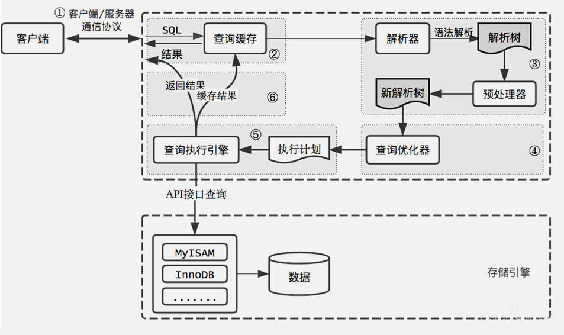
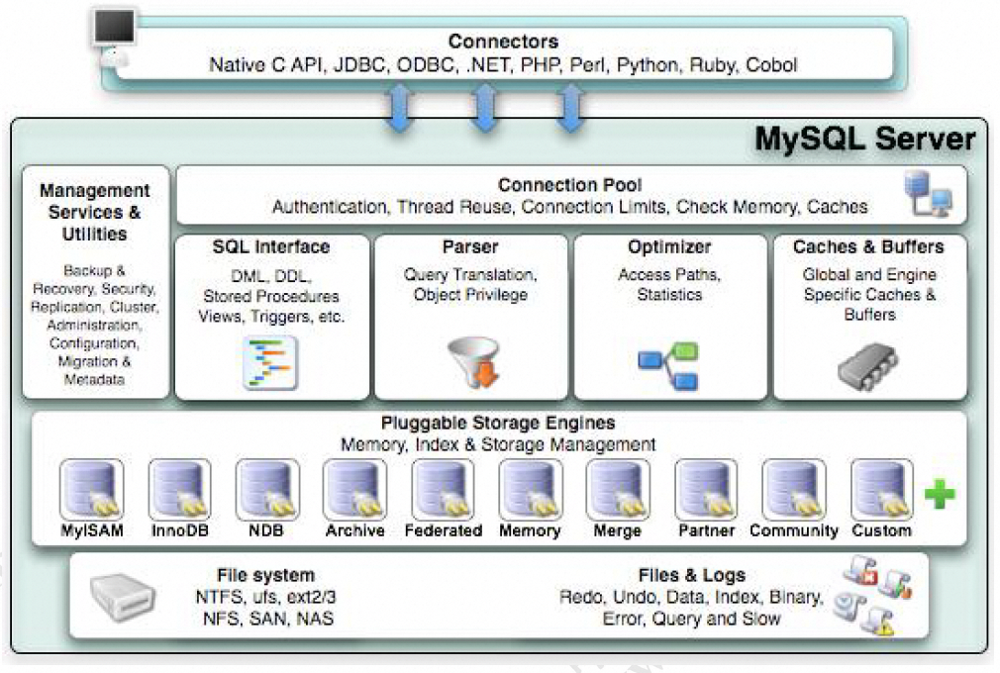
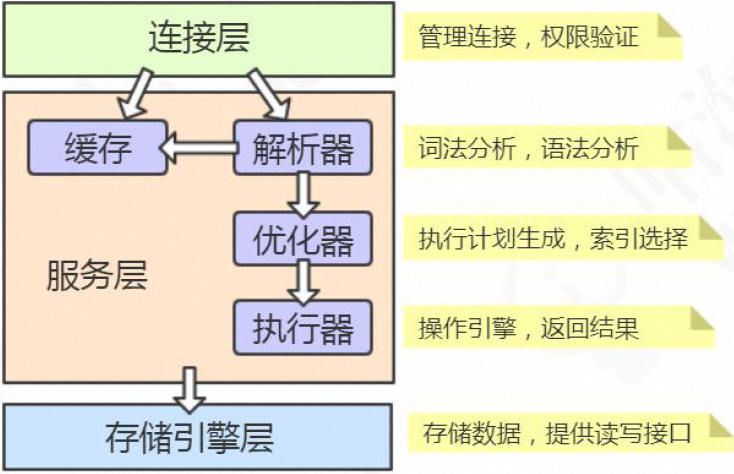
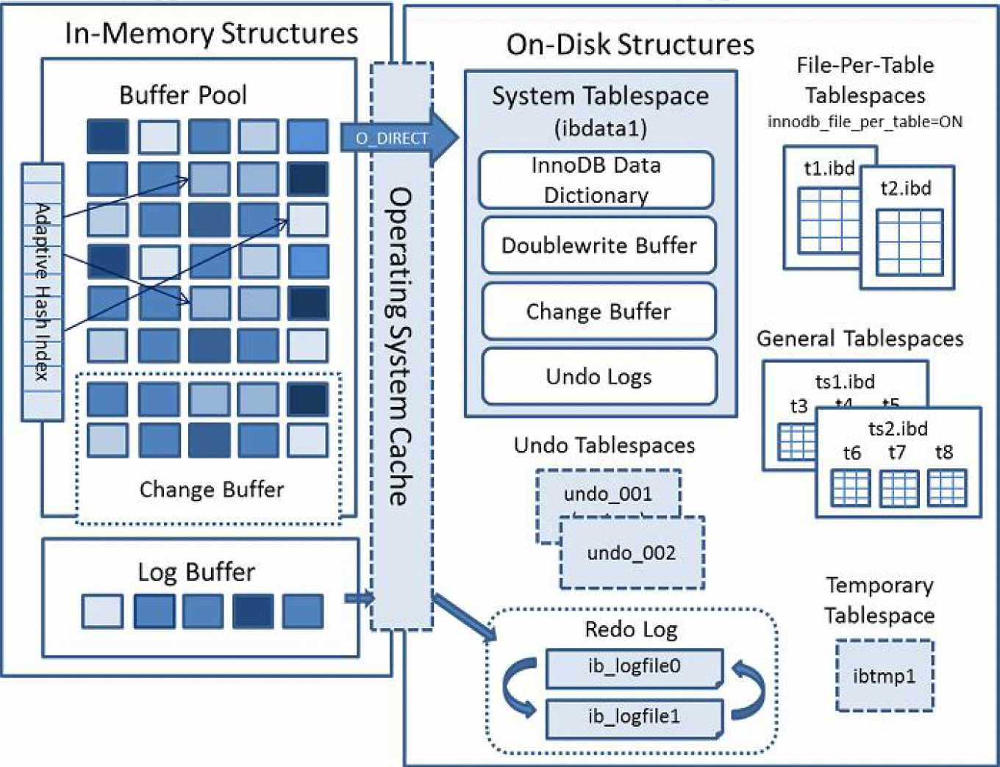

# 1. SQL查询语句的执行过程

1. 通过客户端/服务器通信协议与 MySQL **建立连接**，并查询是否有权限；
  + 通信类型：**`同步`** `异步`
  + 连接方式：**`长连接`** `短连接`
  + 通信协议：`Unix Socket` **`TCP/IP`**
  + 通信方式：`单工` **`半双工`** `全双工`
2. Mysql8.0之前开看是否开启**缓存**，开启了 Query Cache 且命中完全相同的 SQL 语句，则将查询结果直接
返回给客户端；
3. 由**解析器**进行语法语义解析，并生成解析树（如查询是select、表名tb_student、条件是id=‘1’）；
4. **查询优化器**生成执行计划，根据索引看看是否可以优化；
5. **查询执行引擎**执行 SQL 语句，根据**存储引擎**类型，得到查询结果。若开启了 Query Cache，则缓存，否则
直接返回。
# 2. 存储引擎比较
1. MyISAM
  + 支持表级别的锁（插入和更新会锁表）。不支持事务。
  + 拥有较高的插入（insert）和查询（select）速度。
  + 存储了表的行数（count 速度更快）。
  + 适合：只读之类的数据分析的项目。
2. InnoDB
  + 支持事务，支持外键，因此数据的完整性、一致性更高。
  + 支持行级别的锁和表级别的锁。
  + 支持读写并发，写不阻塞读（MVCC）。
  + 特殊的索引存放方式，可以减少IO，提升查询效率。
  + 适合：经常更新的表，存在并发读写或者有事务处理的业务系统。
3. Memory
  + 把数据放在内存里面，读写的速度很快，但是数据库重启或者崩溃，数据会全部消失。只适合做临时表。
  + 将表中的数据存储到内存中。
4. CSV
  + 不允许空行，不支持索引。格式通用，可以直接编辑，适合在不同数据库之间导入导出。
5. Archive
  + 不支持索引，不支持update delete。
# 3. MySQL体系架构
1. 模块详解

  + Connector：用来支持各种语言和SQL 的交互，比如PHP，Python，Java的JDBC；
  + Management Serveices & Utilities：系统管理和控制工具，包括备份恢复、MySQL 复制、集群等等；
  + Connection Pool：连接池，管理需要缓冲的资源，包括用户密码权限线程等等；
  + SQL Interface：用来接收用户的SQL 命令，返回用户需要的查询结果
  + Parser：用来解析SQL 语句；
  + Optimizer：查询优化器；
  + Cache and Buffer：查询缓存，除了行记录的缓存之外，还有表缓存，Key缓存，权限缓存等等；
  + Pluggable Storage Engines：插件式存储引擎，它提供API 给服务层使用，跟具体的文件打交道。
2. 架构分层

  + 跟客户端对接的**连接层**
  + 真正执行操作的**服务层**
  + 跟硬件打交道的**存储引擎层**
# 4. SQL更新语句的执行过程
1. InnoDB 内存结构

  + Buffer Pool主要分为3 个部分： Buffer Pool、Change Buffer、Adaptive HashIndex，另外还有一个（redo）log buffer。
2. InnoDB 磁盘结构
# 整理太耗时，先暂停